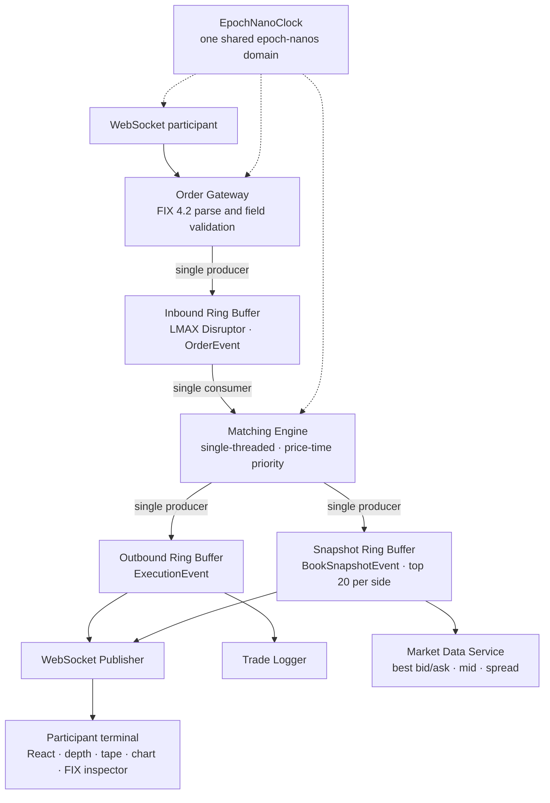

# High Performance Stock Exchange

A miniature stock exchange in Java and React: a FIX order gateway, a lock-free LMAX Disruptor event
pipeline, a single-threaded price-time priority matching engine, a market data and execution
dissemination layer, and a direct-access participant terminal.


This is the venue side of a market, not the broker side. Raw FIX bytes arrive at a gateway, cross a
lock-free ring buffer into a single-threaded matching engine, match under price-time priority, and
fan out as execution reports, depth snapshots and a trade tape to every subscriber, including a
React terminal over WebSocket. The system owns the book and produces the trades. Nothing here routes
an order out to somewhere else, because there is nowhere else: this is where the order rests and
where the fill is born.

It began as a matching engine and outgrew that name. The engine is still the core, but it is now one
component among several that together make a working, if small, exchange: member connectivity over a
FIX protocol subset, a matching core, market data dissemination, a trade reporting tape, and a
participant-facing terminal with its own order entry, blotter, depth views, price chart and FIX
stream inspector.

It is a portfolio project, and every architectural decision is made to demonstrate the skills that
matter in trading-systems engineering: mechanical sympathy, lock-free data structures, protocol-level
networking, honest measurement, and disciplined scope.

The performance characteristics below are measured with JMH, not asserted. Each number is traceable
to a recorded benchmark run, and each is reported with its methodology and its caveats.

---

## Table of contents

- [What this system is, and is not](#what-this-system-is-and-is-not)
- [Architecture](#architecture)
- [The participant terminal](#the-participant-terminal)
- [Performance](#performance)
- [Design principles](#design-principles)
- [Technology stack](#technology-stack)
- [Project structure](#project-structure)
- [Building and running](#building-and-running)
- [Benchmarking](#benchmarking)
- [Testing](#testing)
- [Scope](#scope)
- [Known limitations](#known-limitations)
- [Roadmap](#roadmap)

---

## What this system is, and is not

The distinction drives almost every design decision in the repository, so it is stated up front.

**It is an exchange venue.** It accepts member order flow, maintains the central limit order book,
decides which orders trade and at what price, and publishes the resulting executions and market data.
The book is authoritative here. There is no upstream venue to route to and no downstream broker to
report to.

**It is not an order management system, and not a brokerage.** An OMS manages a client's orders and
routes them to venues. This system is the thing being routed to. The React terminal is not a broker
front end: it is a direct-access participant connected to the venue, in the same position a member
firm's trading screen would be.

**What a real exchange has that this deliberately does not:** multi-symbol and multi-venue routing,
member accounts, pre-trade risk and credit checks, authentication, persistence and crash recovery,
auction and halt states, and a clearing path. These are listed in [Scope](#scope) rather than hidden,
because the gap between this and a production venue is part of what the project is meant to show an
interviewer is understood.

---

## Architecture

The pipeline is a single write path with no locks on the hot section. Each ring buffer has exactly
one producer, so write contention is eliminated by design rather than by synchronization.



**Order Gateway.** The protocol boundary. It receives raw bytes, parses FIX tag-value messages,
validates structure and required fields, stamps receipt time, and publishes `OrderEvent`s onto the
inbound ring buffer. It is the sole producer on that ring. Structural validation happens here; domain
validation is delegated to the `Order` constructor so the two concerns stay separated. Two message
types are supported: `NewOrderSingle` (35=D) and `OrderCancelRequest` (35=F).

**Inbound ring buffer.** A lock-free Disruptor transport between the gateway and the engine. Carrier
objects (`OrderEvent`) are pre-allocated and reused: the gateway copies fields into a slot, the
engine reads them out, and the slot is recycled. Single producer, single consumer.

**Matching Engine.** The core. It maintains the limit order book and executes price-time priority
matching on a single thread as the sole consumer of the inbound ring. No locks, no synchronization,
no contention. The book is a `TreeMap<Long, Deque<Order>>` per side (natural ordering for asks,
reverse ordering for bids), with an `ArrayDeque` at each price level for FIFO time priority and a
`HashMap<Long, Order>` for O(1) cancel lookup, plus two `ArrayDeque` peg pools (one per side) that
hold resting midpoint-peg orders outside the price map. Fills use the passive price convention,
meaning the resting order's price. The engine has no knowledge of FIX, JSON, or WebSocket.

Every order carries a time in force and an order type. Time in force is GTC (an unfilled remainder
rests), IOC (the remainder expires rather than resting) or FOK (the order fills completely or
expires with the book untouched, decided by a pre-trade availability check that shares its
eligibility rule with the match loop). An unfilled IOC or FOK remainder is reported with the
`ORDER_EXPIRED` execution type, distinct from a cancel. Two non-plain order types sit on top of the
limit book: an iceberg rests with a displayed tip over a hidden reserve, reloading to the back of
its price-level queue each time the tip is consumed, so depth snapshots show only the tip; a
midpoint peg is non-displayed, rests in a separate FIFO pool, and executes only at the exact
midpoint of the venue's own lit book, inactive while either lit side is empty. Because limit prices
are `long` units of $0.0001 on the one-cent tick, a midpoint can fall on a half-cent and a fill can
print sub-penny.

**Outbound and snapshot rings.** The engine is the single producer on two outbound Disruptor rings:
one carrying `ExecutionEvent`s (accepted, filled, partially filled, cancelled, rejected, expired) and one
carrying `BookSnapshotEvent` depth snapshots bounded at 20 levels per side. Each consumer holds its
own sequence counter, so a new subscriber is added by registering a consumer with no engine change.

**Market data and trade reporting.** `MarketDataService` consumes the snapshot ring and derives best
bid, best ask, midpoint and spread. `TradeLogger` consumes the outbound ring as the server-side trade
tape, logging fills and ignoring everything else. Neither blocks the other, and neither blocks the
engine.

**Publishers and terminal.** The WebSocket publisher serializes execution and snapshot events to JSON
via Jackson and pushes them to all connected clients over Netty. The React terminal renders the live
market and submits orders back through the gateway. Orders entered in the UI are encoded to real FIX
bytes at the network edge (`JsonToFix`) and fed through the same `FixParser` an external member would
hit, so there is no privileged back door into the engine.

**Time.** A single `EpochNanoClock` instance is constructed at startup and shared by the gateway
receipt stamp, the engine handler's execution and snapshot stamps, and the raw FIX echo at the
WebSocket edge. It anchors `System.currentTimeMillis()` against `System.nanoTime()` once, then serves
`anchor + elapsed`, which yields true epoch nanoseconds at nanosecond resolution. The transform is
affine, so inter-event deltas remain exact and the end-to-end latency measurement is unaffected by
the epoch conversion. One instance is load-bearing: two anchors would differ by the anchor skew and
corrupt a receipt-to-publish delta.

---

## The participant terminal

The frontend is a routed two-page terminal, not a demo page. It is styled as an institutional trading
screen (IBM Plex Sans and Mono, tabular figures, flat charcoal surfaces) with no marketing chrome.
The socket lives above the router, so navigation never drops the connection or resets session state.

| Route | Contents |
|---|---|
| `/trading` | Depth ladder, cumulative depth curve, trade tape, order entry ticket, open orders blotter, cancel-by-ID ticket, FIX stream inspector |
| `/chart` | Session price line with reference lines, plus a side panel holding session high, low, trade count, last print, and a second order ticket |

A persistent header strip renders on both pages: last, change, bid, ask, mid, spread in cents and
basis points, volume and session open.

**Order entry.** The ticket carries the full order menu: a side, a time in force (GTC, IOC, FOK), an
order type (limit or midpoint peg), a price on the one-cent tick, a quantity, and, for a resting
limit order, an optional display quantity that makes it an iceberg. Choosing a midpoint peg disables
the price field and submits at the mid. The blotter labels each working order by type (LMT, ICE,
MID) and time in force, and shows an order ended by its time in force as a terminal, non-cancellable
EXPIRED row.

**Depth ladder and depth curve.** The ladder shows asks above and bids below with a pinned spread and
mid bar, fed only by `BOOK` snapshot frames. The curve is a cumulative step function per side on one
shared price axis, with a shared depth maximum across both sides so imbalance reads truthfully.
Clicking the curve prefills the order ticket's price.

**FIX stream inspector.** The honest one. Inbound entries show the real echoed SOH bytes the parser
actually consumed, byte for byte, with no recomputed body length or checksum. Outbound entries show
the actual execution JSON frames and are labelled as such, because the server builds no outbound
tag-value message and the inspector does not fabricate a `35=8` that does not exist on the wire.

**Session statistics.** High, low, trade count, volume and session open are accumulated in the
reducer per fill rather than folded from the trade tape, because the tape is capped at 200 prints and
would silently forget the extremes. They survive reconnects and navigation. See
[Known limitations](#known-limitations) for what "session" means here.

**Reference market open.** The chart and header can display the official market open for the real
instrument, fetched once per app open from the Alpaca market data API. This is a reference line only.
It never touches the engine, the book, or any price the venue produces, and the venue remains
entirely self-contained without it.

Frontend specifics, including the wire contract, the pure-helper conventions and the test layout,
live in [`app/frontend/FrontendREADME.md`](app/frontend/FrontendREADME.md).

---

## Performance

All figures come from JMH 1.37 on JDK 21.0.8 LTS. See [Benchmarking](#benchmarking) to reproduce.
Read the conditions column: these are single-fork measurements on an unpinned developer machine, so
they are point estimates on one box rather than certified benchmark results. Where a number carries
wide variance it is reported as a range with its confidence interval, never as a bare point estimate.

| Measurement | Result | Conditions |
|---|---|---|
| Order insert latency | approximately 110 ns, flat from 1 to 10,000 resting orders | engine in isolation, `AverageTime` |
| Engine throughput | approximately 8.2M orders/sec (99.9% CI 7.7 to 8.7M) | blended rest/cross workload, book held shallow |
| Fill-walk cost | approximately 100 ns per price level consumed, O(N) | aggressive order walking N levels |
| Snapshot read path | 0 B/op (zero allocation) | top-of-book snapshot into a reused carrier |
| End-to-end latency | p50 4.8 µs, p99 9.5 µs, p99.9 18.3 µs | full pipeline, closed-loop service time |

**Book depth has no measurable effect on insert cost.** Inserting an order into a book holding 1
resting order and inserting into a book holding 10,000 resting orders cost the same within noise
(115 ns versus 147 ns, confidence intervals overlapping). This is consistent with the O(log N)
`TreeMap` insert being too small to resolve against per-operation noise. It is reported as "no
measurable degradation", not as "measured O(log N)", because the data does not resolve the trend.

**The fill path is genuinely O(N).** Unlike a single insert, an aggressive order that walks N price
levels costs proportionally more in both time and allocation (approximately 100 ns and approximately
120 bytes per level consumed). This is a real, resolvable per-level cost, not a trend read into
noise, and it is the honest counterpoint to the flat insert curve.

**End-to-end latency is transport-bound, not matching-bound.** The approximately 4.8 µs median for a
full gateway-to-execution round trip is dominated by the Disruptor consumer wakeup, the gateway
parse, and the inbound publish. The actual match plus trade construction plus publish is on the order
of 100 to 250 ns of that figure. The lever for this latency is the Disruptor wait strategy (a
busy-spin or yielding strategy would keep the consumer hot and collapse the median toward the
engine's sub-microsecond floor, at the cost of a burned core), not the engine itself. This is
measured as closed-loop service time with one order in flight, so it is not a saturation-latency SLA.

### Allocation, stated precisely

The system's zero-allocation claim is scoped honestly, because an unqualified version would be false
and is exactly what an interviewer probes.

- **Zero allocation holds for the ring transport.** Pre-allocated slots and reused mutable carriers
  mean the inbound-to-engine-to-outbound path allocates nothing in steady state.
- **Zero allocation also holds for the snapshot read path.** The `snapshotInto` method that fills a
  depth snapshot allocates 0 B/op after warmup. Its only allocations are non-escaping map and deque
  iterators, and the JIT's escape analysis scalar-replaces them. This was validated under JMH across
  book depths from 1 to 10,000 levels, with no garbage collection triggered across the entire run.
- **The matching engine's book structures do allocate.** A resting insert costs approximately 165
  B/op: a 56-byte `Order` plus approximately 109 bytes of collection-node and boxing overhead. The
  dominant cost is `Long` boxing at the `TreeMap` and `HashMap` boundary, where the `long`-units
  discipline used everywhere else is undone. The known fix (primitive-keyed maps such as a
  `Long2ObjectRBTreeMap`) is a deliberate non-goal at this scale, and is documented as understood
  rather than as an outstanding task.

---

## Design principles

These are the invariants the implementation holds to, drawn from the system requirements.

1. **Zero allocation on the hot path.** Ring buffer slots are pre-allocated, event carriers are
   mutable and reused, and prices and timestamps are primitives. This eliminates GC pauses during
   matching. The scope of the claim is stated precisely above.
2. **Single-writer principle.** Each ring buffer has exactly one producer (the gateway inbound, the
   engine outbound), which removes write contention without locks.
3. **Mechanical sympathy.** Ring buffer slots are laid out for cache-line-friendly sequential access,
   Disruptor pads its sequence counters to prevent false sharing, and the engine reads events in
   order to maximize L1 and L2 cache hits.
4. **Logging off the hot path.** SLF4J logging occurs only at the boundaries (the gateway on receipt
   and the publisher on dispatch). The matching engine's inner loop contains no logging calls.
5. **Protocol boundary separation.** FIX parsing and JSON serialization happen only at the edges. The
   core pipeline operates on Java primitives and pre-allocated objects, and the engine has no
   knowledge of any wire format. `FixParser` never imports a Netty or Disruptor type: its boundary is
   a raw `byte[]`.
6. **Integer money, integer time.** Prices are `long` units of $0.0001 (the one-cent tick is 100
   units) and timestamps are `long` epoch nanoseconds everywhere, backend and frontend. Floating
   point appears only at the render edge, when a scale maps a domain value to a pixel, or when a
   sub-penny midpoint print is formatted for display. No `BigDecimal`, no `double` arithmetic on a
   price.
7. **Pure core, thin edge.** On both sides of the wire, the maths lives in a pure module with no I/O
   and no framework types, and the component or handler around it owns only the edge concern. This is
   what makes the engine testable with no ring buffer in the loop, and the depth curve, price series
   and session statistics testable with no DOM in the loop.
8. **Scope discipline.** A feature is included only if it serves the core goals of low-latency
   architecture, event-driven design, financial domain knowledge, or full-stack integration.
   Over-engineering is actively resisted.

---

## Technology stack

| Layer | Technology |
|---|---|
| Language | Java 21 LTS (bytecode target; developed on JDK 25) |
| Build | Maven |
| Concurrency transport | LMAX Disruptor 4.0 ring buffers |
| Networking | Netty 4.2 (WebSocket server, `netty-codec-http`) |
| Serialization | Jackson 2.18 (JSON at the boundary) |
| Protocol | FIX 4.2 subset (`NewOrderSingle`, `OrderCancelRequest`), hand-rolled parser |
| Logging | SLF4J 2.0 |
| Backend testing | JUnit 5 |
| Benchmarking | JMH 1.37 via `pw.krejci:jmh-maven-plugin` |
| Frontend | React 19, TypeScript 5.9, Vite 8, React Router 7 |
| Frontend testing | Vitest 4, Testing Library, jsdom |
| Reference market data | Alpaca market data API (development proxy only) |

Explicitly not used: Spring Boot or any dependency-injection framework, QuickFIX/J, `BigDecimal`,
`LocalDateTime`, and any blocking queue on the hot path. Each omission is a deliberate choice, not an
oversight.

A note on the JDK split: the code is developed on JDK 25 and compiled to Java 21 bytecode
(`maven.compiler.release=21`), and all published performance numbers are measured on JDK 21 LTS.
Percentiles on a non-LTS runtime are less defensible in a portfolio than the same numbers on the LTS
release a trading firm would actually pin, so 21 is the measurement target.

---

## Project structure

```
high-performance-stock-exchange/
├── app/
│   ├── backend/                                # Maven module: engine, gateway, pipeline, publishers
│   │   ├── pom.xml                             # Dependencies, Java 21 release target, JMH plugin
│   │   └── src/                                # main/java (below) and test/java (below)
│   └── frontend/                               # Vite + React participant terminal (independent build)
│       ├── package.json                        # Scripts and dependencies (npm)
│       ├── vite.config.ts                      # Dev server, Alpaca dev proxy, Vitest config
│       ├── index.html                          # Vite entry document
│       ├── FrontendREADME.md                   # Terminal architecture, wire contract, caveats
│       ├── src/                                # Application sources (below)
│       └── test/                               # Vitest unit and render tests
└── README.md
```

### Backend, main sources

```
app/backend/src/main/java/
├── Main.java                                   # Entry point: assembles the full venue and runs the server
├── model/
│   ├── Order.java                              # Mutable order; domain validation in the constructor
│   ├── Side.java                               # BUY / SELL
│   ├── Status.java                             # OPEN, PARTIALLY_FILLED, FILLED, CANCELLED, EXPIRED
│   └── Trade.java                              # Immutable fill record (price in units of $0.0001, both order ids)
├── engine/
│   ├── MatchingEngine.java                     # The book: price-time priority matching, single-threaded, framework-free
│   ├── BookView.java                           # Read-only top-of-book seam (best bid / best ask)
│   ├── ExecutionListener.java                  # Execution callback seam: primitives only, zero allocation
│   └── MatchingEngineHandler.java              # Disruptor adapter: OrderEvent in, ExecutionEvent + snapshots out
├── gateway/
│   ├── OrderGateway.java                       # Inbound ring producer: the FIX-wire / hot-path boundary
│   ├── FixParser.java                          # Hand-rolled FIX 4.2 tag-value parser (byte[] in, no framework types)
│   ├── FixFrameDecoder.java                    # Length-prefixed framing: emits one complete message at a time
│   └── FixConstants.java                       # SOH delimiter and the in-scope FIX tag numbers
├── event/
│   ├── OrderEvent.java                         # Mutable inbound carrier (gateway → engine)
│   ├── OrderEventFactory.java                  # Pre-allocates the inbound ring slots
│   ├── OrderEventType.java                     # NEW_ORDER / CANCEL_ORDER discriminator
│   ├── ExecutionEvent.java                     # Mutable outbound carrier (engine → subscribers)
│   ├── ExecutionEventFactory.java              # Pre-allocates the outbound ring slots
│   ├── ExecutionEventType.java                 # Accepted, filled, partially filled, cancelled, rejected, expired
│   ├── BookSnapshotEvent.java                  # Mutable bounded depth carrier (20 levels per side)
│   ├── BookSnapshotEventFactory.java           # Pre-allocates the snapshot ring slots
│   ├── InboundPipeline.java                    # Inbound Disruptor wiring: ring size and wait strategy
│   ├── OutboundPipeline.java                   # Outbound Disruptor wiring: independent consumers, own sequences
│   └── SnapshotPipeline.java                   # Snapshot Disruptor wiring: the depth feed
├── publisher/
│   ├── WebSocketPublisher.java                 # Fan-out: EXEC and BOOK frames as JSON to every connected client
│   └── TradeLogger.java                        # Server-side trade tape: logs fills, ignores everything else
├── net/
│   ├── WebSocketServer.java                    # Netty WebSocket server, exposes /ws
│   ├── WebSocketFrameHandler.java              # Per-connection handler: channel registration, inbound text frames
│   ├── JsonToFix.java                          # Manual JSON order → FIX 4.2 bytes, fed back through the real gateway
│   └── package_info.java                       # Package docs: the networking boundary
├── market/
│   └── MarketDataService.java                  # Snapshot consumer: best bid/ask, midpoint, spread
└── util/
    ├── EpochNanoClock.java                     # One shared epoch-nanos time domain, affine over nanoTime
    └── IDGenerator.java                        # Monotonic order / participant / trade ids
```

### Backend, tests and benchmarks

```
app/backend/src/test/java/
├── engine/
│   ├── MatchingEngineHandlerTest.java          # Adapter behaviour: inbound event to execution event
│   ├── MatchingEngineHandlerSnapshotTest.java  # Snapshot publication from the adapter
│   ├── MatchingEngineSnapshotTest.java         # snapshotInto correctness across book depths
│   └── MatchingEngineBookReadTest.java         # Top-of-book reads on an empty and a populated book
├── gateway/
│   ├── FixParserTest.java                      # Valid messages, missing tags, malformed input, SOH handling
│   ├── FixParserScanTest.java                  # Tag scanning over the raw byte buffer
│   ├── FixParserPriceTest.java                 # Decimal price → integer units of $0.0001, no floating point
│   ├── FixParserChecksumTest.java              # Trailer (10=) validation
│   ├── FixFrameDecoderTest.java                # Framing: partial, split, and back-to-back messages
│   ├── JsonToFixParseTest.java                 # JSON order → FIX bytes the parser accepts
│   └── OrderGatewayTest.java                   # Publication onto the inbound ring
├── event/
│   ├── InboundPipelineTest.java                # Ring wiring, slot reuse, and field reset
│   ├── CapturingOrderHandler.java              # Test double: records OrderEvents off the ring
│   ├── CapturingExecutionHandler.java          # Test double: records ExecutionEvents
│   └── CapturingSnapshotHandler.java           # Test double: records BookSnapshotEvents
├── net/
│   ├── WebSocketServerTest.java                # Server bring-up and handshake
│   ├── WebSocketFrameHandlerTest.java          # Frame handling and channel-group registration
│   └── WebSocketRoundTripTest.java             # Client frame in, published frame out
├── publisher/
│   ├── WebSocketPublisherTest.java             # EXEC / BOOK JSON serialization and fan-out
│   └── TradeLoggerTest.java                    # Fills only reach the tape
├── market/
│   └── MarketDataServiceTest.java              # Midpoint and spread derivation
├── util/
│   └── EpochNanoClockTest.java                 # Epoch anchoring and exact delta preservation
├── integration/
│   └── EndToEndPipelineTest.java               # FIX at the gateway through to an execution at a subscriber
└── benchmark/
    ├── MatchingEngineDepthBenchmark.java       # Insert latency as a function of book depth
    ├── MatchingEngineThroughputBenchmark.java  # Orders per second through the engine in isolation
    ├── MatchingEngineFillWalkBenchmark.java    # Cost of an order walking N price levels
    ├── MatchingEngineSnapshotBenchmark.java    # Whether the depth-snapshot read path allocates
    ├── OrderAllocationBaselineBenchmark.java   # The Order allocation floor, for subtraction
    └── EndToEndLatencyBenchmark.java           # Gateway-to-execution percentiles (gated closed-loop harness)
```

### Frontend

```
app/frontend/src/
├── main.tsx                                    # React entry point, mounts BrowserRouter
├── App.tsx                                     # Socket owner and sole frame sender; routes to the two pages
├── format.ts                                   # Units of $0.0001 ↔ dollars and clock formatting as integer string math
├── depth.ts                                    # Pure cumulative depth and depth-curve model
├── priceSeries.ts                              # Pure session price series for the chart
├── sessionStats.ts                             # Pure session high / low / count / last-print model
├── pages/
│   ├── TradingPage.tsx                         # Depth, tape, ticket, blotter, cancel ticket, inspector
│   └── PriceChartPage.tsx                      # Session price chart plus the session detail panel
├── components/
│   ├── Navbar.tsx                              # Route tab strip, active state owned by the router
│   ├── Header.tsx                              # Persistent top-of-book strip, derived purely from BOOK
│   ├── DepthLadder.tsx                         # Depth ladder: asks above, bids below, BOOK only
│   ├── DepthCurve.tsx                          # Cumulative depth step curve, click-to-prefill price
│   ├── TradeTape.tsx                           # Newest-first fill tape, capped at 200 prints
│   ├── PriceChart.tsx                          # Session trade-print line with reference lines
│   ├── SessionStats.tsx                        # High, low, trade count, last print
│   ├── OrderEntry.tsx                          # Manual order entry: transient form state, emits a typed order intent
│   ├── OpenOrders.tsx                          # Working orders and the per-row cancel intent
│   ├── CancelTicket.tsx                        # Cancel by typed OrigClOrdID, including untracked orders
│   ├── FixInspector.tsx                        # Raw inbound FIX bytes and outbound EXEC frames
│   └── ConnectionBadge.tsx                     # connecting / open / reconnecting pill
├── protocol/
│   ├── messages.ts                             # The wire contract: the only place raw JSON becomes typed
│   ├── encode.ts                               # Outbound frame construction and ClOrdID generation
│   └── fix.ts                                  # Pure FIX tag-value parsing for the inspector
├── state/
│   ├── reducer.ts                              # Pure state: BOOK replaces the book, EXEC never touches it
│   ├── useOrderBook.ts                         # Socket lifecycle: capped-backoff reconnect, dispatches to the reducer
│   └── useIgnitionPrice.ts                     # One-shot reference market-open fetch, isolated from the socket
├── market/
│   ├── ignition.ts                             # Pure Alpaca snapshot → integer units of $0.0001
│   └── alpacaClient.ts                         # The one impure edge: same-origin fetch through the dev proxy
└── styles/
    └── terminal.css                            # Terminal theme: IBM Plex, flat charcoal, tabular figures
```

Maven runs from `app/backend/`, and npm runs from `app/frontend/`. The two build independently.

The matching engine is framework-free: the `event` carriers stay free of Disruptor types, and only
their `*Factory` classes touch `com.lmax`. This keeps the core testable in isolation with no ring
buffer or network in the loop. The same split holds on the frontend, where `depth.ts`,
`priceSeries.ts`, `sessionStats.ts` and `protocol/fix.ts` are pure modules tested without a DOM.

---

## Building and running

**Prerequisites:** a JDK (21 or later), Maven, and Node.js 20.19 or later for the frontend.

Backend:

```bash
cd app/backend
mvn clean install
mvn exec:java -Dexec.mainClass=Main
```

The backend stands up the Netty WebSocket server on port 8080 (override with the first CLI argument)
and the full pipeline. It seeds no orders by design: seeding would mean publishing from the main
thread and breaking the single-writer discipline, so the first client order is the first thing in the
book.

Frontend:

```bash
cd app/frontend
npm install
npm run dev
```

The terminal connects to the backend over WebSocket at `ws://localhost:8080/ws` and renders the live
market.

**Optional reference market data.** The market-open reference line is off unless Alpaca credentials
are present. Create `app/frontend/.env.local` with the following, then restart the dev server:

```
ALPACA_KEY_ID=your_key_id
ALPACA_SECRET_KEY=your_secret_key
```

These are deliberately not `VITE_`-prefixed, so they are loaded into the Vite node process only and
never reach the client bundle. The dev server proxies a same-origin `/alpaca/...` path and injects
the headers server-side, which also means browser CORS never arises. Without the file, the reference
line is simply absent and everything else works unchanged. See
[Known limitations](#known-limitations) for why this is a development-only arrangement.

---

## Benchmarking

Benchmarks live under `app/backend/src/test/java/benchmark/` and run through the JMH Maven plugin.
They never run as part of `mvn test`; invocation is explicit. Run them from `app/backend/` in a shell
with JDK 21 active:

```bash
export JAVA_HOME="/path/to/jdk-21"
export PATH="$JAVA_HOME/bin:$PATH"
java -version   # confirm 21.x before proceeding

mvn jmh:benchmark
```

Useful selectors (the plugin exposes the full JMH CLI as `jmh.*` properties):

```bash
# a single benchmark class
mvn jmh:benchmark -Djmh.benchmarks=MatchingEngineDepthBenchmark

# allocation profiling (reports gc.alloc.rate.norm in bytes per operation)
mvn jmh:benchmark -Djmh.benchmarks=MatchingEngineSnapshotBenchmark -Djmh.prof=gc

# more forks for tighter cross-JVM variance on the timing numbers
mvn jmh:benchmark -Djmh.f=3
```

The benchmark suite covers the following questions, each in its own class:

| Benchmark | Question |
|---|---|
| `MatchingEngineDepthBenchmark` | insert latency as a function of book depth |
| `MatchingEngineThroughputBenchmark` | orders per second through the engine in isolation |
| `OrderAllocationBaselineBenchmark` | the `Order` allocation floor, for subtraction |
| `MatchingEngineFillWalkBenchmark` | matching cost when an order walks N price levels |
| `MatchingEngineSnapshotBenchmark` | whether the depth-snapshot read path allocates |
| `EndToEndLatencyBenchmark` | gateway-to-execution latency percentiles (closed-loop harness) |

The end-to-end latency harness is a gated JUnit runner rather than a JMH benchmark, because the
measured operation completes on a different thread from the one that starts it. It records the true
publication span into a pre-allocated array and sorts for exact percentiles. Run it with
`-De2e.latency=true`.

---

## Testing

**Backend: 257 JUnit 5 tests across 25 classes.** They cover the matching engine (placement,
price-time priority, partial and full fills, cancel, empty book, depth snapshots, time in force with
IOC and FOK expiry and the FOK availability check, iceberg tip and reload, and midpoint-peg pools
with exact-mid execution), the FIX parser (valid messages, missing tags, malformed input,
decimal-to-units conversion, the order-type and time-in-force tags 40, 44, 18, 59 and 111, checksum,
framing across partial and back-to-back messages), the event carriers (correct field copying and
reset across ring-buffer slot reuse), the WebSocket edge, the publishers and market data service,
the shared epoch clock, and the full pipeline end to end from a FIX message at the gateway to an
execution event at a subscriber.

```bash
cd app/backend
mvn test
```

**Frontend: 388 Vitest tests across 32 files.** Pure logic and render tests are kept in separate
files by convention (`X.test.ts` for logic, `X.render.test.tsx` for components), Vitest globals are
deliberately off, and render tests use an explicit `afterEach(cleanup)` rather than a global.

```bash
cd app/frontend
npm test
```

Typecheck separately with `npx tsc --noEmit`.

Beyond the automated suites, each delivered phase closes with a scripted manual acceptance run
against a live backend and dev server, with the scenarios and their results recorded in that phase's
build guide.

---

## Scope

**In scope:** limit order matching with price-time priority, time in force on every order (GTC, IOC,
FOK), iceberg and midpoint-peg order types, order submission and cancellation, a FIX tag-value
protocol subset, a Disruptor-based event pipeline, bounded depth snapshots and derived market data,
a server-side trade tape, WebSocket dissemination, a routed React participant terminal with depth,
tape, charting, order entry, a blotter and a FIX stream inspector, and JMH latency and allocation
benchmarking.

**Out of scope, deliberately:** Spring Boot or any dependency-injection framework, AI or LLM trading
agents, persistence and crash recovery, multi-symbol and multi-venue routing, member accounts and
pre-trade risk, auction and halt states, clearing and settlement, and authentication. These are
omitted to keep the project focused on the systems and domain concepts it exists to demonstrate.
They are also the features that separate this venue from a production exchange, and are called out
here rather than hidden.

---

## Known limitations

Stated plainly, because each one is a thing an interviewer would find anyway.

- **Non-displayed size leaks on the execution stream.** Depth snapshots stay honest: an iceberg
  shows only its tip and a midpoint peg never appears. But execution reports are broadcast to every
  connected client, not only to the session that owns the order, and `ORDER_ACCEPTED` and fill
  events carry an order's total remaining quantity. So a client watching the execution stream can
  reconstruct an iceberg's hidden reserve or a resting peg's size. A real venue routes execution
  reports only to the owning session; closing this needs per-participant sessions and routing, which
  is out of scope.

- **Single instrument.** The engine holds one book. Multi-symbol support is a routing and
  partitioning problem that would change the threading model, which is why it is a non-goal rather
  than a missing feature.
- **No persistence.** The book lives in memory. A restart is a clean market open.
- **Session statistics are connect-anchored.** High, low, trade count, volume and session open
  accumulate from the moment the browser session connected, not from the true venue session open, so
  connecting mid-session undercounts them. They survive a reconnect blip and navigation. The clean
  fix is the engine publishing session statistics or a connect snapshot, which is backend scope and
  is parked.
- **The price chart is bounded to the last 200 prints** (the tape cap), while the side panel's high,
  low and trade count are not. On a long session the two can legitimately disagree about the
  session's extremes. The fix is a dedicated price-history slice, not a change to the panel.
- **The reference market-open feed is development-only.** It relies on the Vite dev server proxy to
  hold the Alpaca credentials server-side. A static `vite build` bundle has no proxy, so a real
  deployment needs a backend proxy endpoint holding those credentials. The value is also fetched once
  per app open and does not roll across a trading-day boundary without a reload.
- **The reference instrument and the synthetic book trade at different levels.** The real market open
  sits far from where the demo book trades, so the market-open reference line is frequently outside
  the plotted domain and correctly absent. This is expected, not a bug.
- **Performance figures are single-fork, single-machine.** They are point estimates on an unpinned
  developer box, not certified results. See [Performance](#performance) for the per-measurement
  conditions.

---

## Roadmap

The venue core, pipeline, gateway, WebSocket dissemination, participant terminal and benchmark suite
are complete. Remaining work is portfolio polish: terminal screenshots captured on a running stack,
and the results write-up.

Documented future direction, understood but out of scope at this stage:

- Primitive-keyed order book maps to remove the `Long` boxing measured on the insert and fill paths.
- A busy-spin or yielding Disruptor wait strategy to trade a core for lower median end-to-end latency
  under load.
- Multi-fork benchmark runs on a pinned, quiet machine to tighten the timing confidence intervals.
- Engine-published session statistics, which would retire the connect-anchoring caveat above.
- Derived indicators in the terminal (VWAP first), which the reducer accumulator pattern already
  accommodates.
- Algorithmic participant bots trading against the book from outside the venue, each running a simple
  strategy. They would connect through the gateway like any other member. They are deliberately
  algorithmic rather than LLM-driven: a model in the loop is incompatible with the latency
  philosophy of the system they would be trading on.

---
